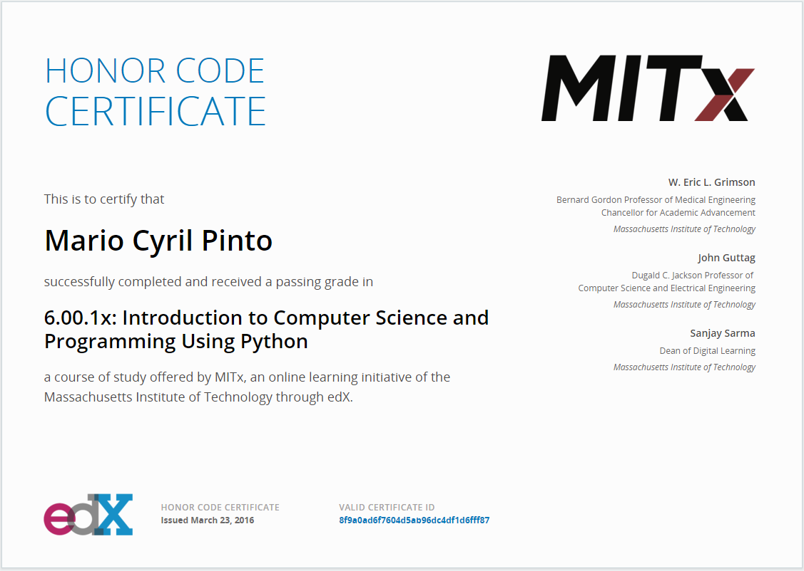
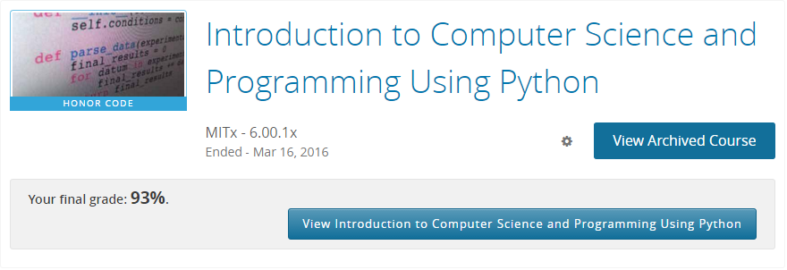
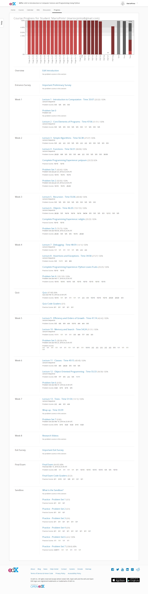

## Course Completion Records

This is my course completion record for the course [Introduction to Computer Science and Programming Using Python](https://www.edx.org/course/introduction-computer-science-mitx-6-00-1x-6):

## Final Score:

## Course Activity Completion:

Note: Even though I missed the deadline for two assignments (since I was on vacation), I completed them later (as seen in the sandbox section below):  

