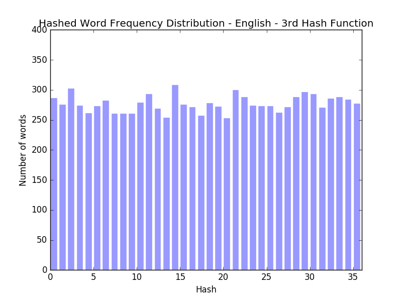

### Comparing Hash Functions

As part of problem 8 in [lecture 10](../../Lecture_Notes/Lecture_10.md) of the edx MOOC
[Introduction to Computer Science and Programming Using Python](https://www.edx.org/course/introduction-computer-science-mitx-6-00-1x-6),
three hash function are provided:

* First Hash Function:
```python
def hash(s):
    return string.ascii_lowercase.index(s[0])
```
* Second Hash Function:
```python
def hash(s):
    return string.ascii_lowercase.index(s[-1])
```
* Third Hash Function:
```python
def hash(s):
    total = 0
    for char in s:
        total += string.ascii_lowercase.index(char)
    return total % 26
```

Asif Mehedi contributed [code](reference_file.py) to plot the performance
of the above three hash functions on a [list](words.txt) of 80,000+ English words.

Below, I have extended this work to compare the performance of the above three hash functions
on the top 10,000 English, French, German and Dutch words.

#### Notes:

* The list of top 10,000 words for the four languages was obtained from [this source](http://www.streetsmartlanguagelearning.com/2008/12/top-10000-words-in-dutch-english-french.html).
* For English and German the top 10,000 words included numerals  - these were left as is.
* Accented letters were treated to be different from unaccented letters e.g. é was treated to be different from e.
* Refer to [this document](http://www.unicode.org/charts/PDF/U0080.pdf) to interprit unicode codes listed in the results section.
* Links to the code used:
    * [compare_hash_functions.py](compare_hash_functions.py)
    * [hash_functions.py](hash_functions.py)
    * [helper_functions.py](helper_functions.py)

#### Original Results

The results obtained by Asif are shown below:
* First Hash Function:

* Second Hash Function:

* Third Hash Function:


#### New Results: English

For the top 10,000 English words, the following results were obtained:  
* Unique Character Set (order corresponds to the plots that follow):
```python
['0', '1', '2', '3', '4', '5', '6', '7', '8', '9', 'a', 'b', 'c', 'd', 'e', 'f', 'g', 'h', 'i', 'j', 'k', 'l', 'm', 'n', 'o', 'p', 'q', 'r', 's', 't', 'u', 'v', 'w', 'x', 'y', 'z']
```
* First Hash Function:

* Second Hash Function:

* Third Hash Function:


#### New Results: French

For the top 10,000 French words, the following results were obtained:  
* Unique Character Set (order corresponds to the plots that follow):
```python
['a', 'b', 'c', 'd', 'e', 'f', 'g', 'h', 'i', 'j', 'k', 'l', 'm', 'n', 'o', 'p', 'q', 'r', 's', 't', 'u', 'v', 'w', 'x', 'y', 'z', '\xe4', '\xe9', '\xfc']
```
* First Hash Function:

* Second Hash Function:

* Third Hash Function:


#### New Results: German

For the top 10,000 German words, the following results were obtained:  
* Unique Character Set (order corresponds to the plots that follow):
```python
[' ', '0', '1', '2', '3', '5', '8', '9', 'a', 'b', 'c', 'd', 'e', 'f', 'g', 'h', 'i', 'j', 'k', 'l', 'm', 'n', 'o', 'p', 'q', 'r', 's', 't', 'u', 'v', 'w', 'x', 'y', 'z', '\xc4', '\xd6', '\xdc', '\xdf', '\xe4', '\xe9', '\xf6', '\xfc']
```
* First Hash Function:

* Second Hash Function:

* Third Hash Function:


#### New Results: Dutch

For the top 10,000 Dutch words, the following results were obtained:  
* Unique Character Set (order corresponds to the plots that follow):
```python
['a', 'b', 'c', 'd', 'e', 'f', 'g', 'h', 'i', 'j', 'k', 'l', 'm', 'n', 'o', 'p', 'q', 'r', 's', 't', 'u', 'v', 'w', 'x', 'y', 'z', '\xdf', '\xe9', '\xf6', '\xfc']
```
* First Hash Function:

* Second Hash Function:

* Third Hash Function:


#### Conclusion:
The results are as predicted by the course staff:
>The course staff's best guess (for languages that use the Roman alphabet) is that the same results will hold - the first two hash functions won't be good (but will, of course, have different high/low buckets), while the third proves to be a decent hash function.
